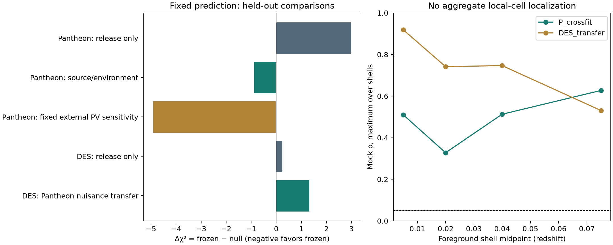
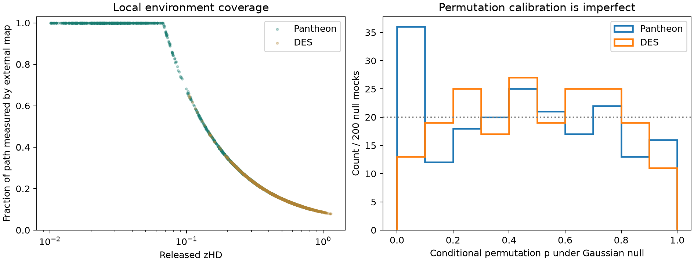

# BHSM supernova sightline tomography V1

## Scientific answer

**A robust residual following the frozen topographic prediction is not established.** With source/environment nuisance relations learned only from the original Pantheon training set, the held-out fixed-template improvement is small: Δχ² = -0.883, likelihood ratio 1.555, conditional one-sided Gaussian-mock p = 0.0725. The overlap-clean DES transfer prefers the null: Δχ² = 1.321. A fixed independent PV mean produces a stronger Pantheon sensitivity result, but its new field-error covariance is unavailable. It is not a fully recalibrated discovery likelihood.

The aggregate local-cell correlation tests do not localize residual correlations to a radial shell. Pantheon has some directional and high-density-subset preference, but it is uneven across surveys and sky sectors. These outcomes do not determine whether the physical cause is optical history, velocity correction, calibration, or another environment-dependent effect. The complete source-reduced, externally constrained, jointly marginalized scientific question remains **unresolved**, because the necessary joint light-curve/calibration/BBC and external-field error propagation is not supplied by this local reconstruction.

All frozen scientific parameters are preserved. No axis, transfer law, cutoff, cosmology, predictive amplitude, or sample threshold was selected to improve agreement. The exploratory fitted amplitude below is never substituted into a predictive test. Earlier result packages pass their original hash manifests unchanged.

## Frozen state and data ordering

R1: Ωm=0.31, Ωr=0.00009, Ωk=−0.018, λ=1, q=3, V0=2.3986073. Axis (RA, Dec)=(211.48°, −12.81°); A=-0.043216234359972079 mag, zref=.02, zc=.03. The local transfer is H_K(χ) min(χ,χc)/[H_K(χref)χref]. The previous global table and 1:5 conditional partition remain bundled unchanged; this analysis tests the local topographic prediction. A is conditional on its previous low-redshift training, not a new independent prior draw.

Pantheon: 1,701 original rows and original STAT+SYS covariance; decimal asymmetry is symmetrized at the documented 3×10⁻⁸ level. DES: 1,820 original rows; the complete released precision is inverted before any row selection. Duplicate Pantheon observations retain their covariance and row identities. DES uses actual SN header positions, and the previous overlap exclusion is retained. No covariance difference is interpreted as an independent PV covariance.

| dataset | rows | unique_SN | external_PV_rows | median_map_path_fraction |
|---|---|---|---|---|
| DES | 1467 | 1467 | 0 | 0.14201 |
| Pantheon | 1565 | 1446 | 581 | 0.38252 |

The original Pantheon training sample has 357 rows / 274 CIDs; its 1,208 held-out rows contain no training SN. DES contains 1,467 retained rows. All 3,521 raw HD rows have a sightline record even when excluded by the frozen science cuts. `UNIQUE_SN_INDEX.csv` indexes repeated rows; cross-release identities remain explicit through the existing overlap audit.

## Level 1: source reconstruction and stability

Individual epochs and bands were loaded from the pinned public SNANA releases. Nominal SALT2-B21 and SALT3-Dovekie models, released primary-standard/passband tables, and the documented SNANA MAG_OFFSET=0.27 were used. Fits hold redshift fixed and separate log flux normalization, x1, color, and peak epoch. Remaining band contrasts are projected orthogonally to those source columns; phase contrasts are then projected orthogonally to both. Per-epoch decomposed residuals and each four-parameter covariance/estimator are retained.

| dataset | local_fit_not_converged | ok |
|---|---|---|
| DES | 22 | 1798 |
| Pantheon | 19 | 1682 |

There are 3480 converged reconstructions and 41 non-converged local fits; these numerical failures remain in the package and do not remove any HD row. Exact SNID matching resolves the nominal 2005df row; the two public photometry alternatives are also retained separately. The fixed diagnostic window is −15..45 rest days, with positive finite uncertainties, supported passbands, at least five epochs and two bands. This is a local reconstruction, not an exact SNANA/BBC rerun.

Band jackknifes, three phase-block jackknifes, and individual-MJD epoch deletions use the local linear response at the reconstructed solution. Individual epoch deletion groups simultaneous bands together: 132,494 epoch groups are tested, with rank failures retained. Their uncertainty is the covariance of the **difference of estimators on shared epochs**, not a sum of independent-fit variances. Direct retained-epoch refits verify the local deletion formula to 7.6×10⁻¹⁵ in parameter units. They are not full nonlinear refits. All nine Pantheon and ten DES released spectral/calibration realizations were evaluated as local responses. There are 33,509 nominal-row systematic responses, of which 500 have incomplete calibration mappings; these are flagged, not silently treated as complete released realizations.

Median absolute maximum jackknife excursions and RMS across the supplied systematic realizations, in magnitudes:

| dataset | band_jackknife_max | epoch_jackknife_max | single_epoch_jackknife_max | systematic_common_rms |
|---|---|---|---|---|
| DES | 0.054332 | 0.081099 | 0.028784 | 0.002651 |
| Pantheon | 0.043783 | 0.054794 | 0.020281 | 0.0054276 |

These excursions are descriptive stability diagnostics, not calibrated additional distance errors. `SURVEY_STABILITY_SUMMARY.csv` preserves survey-specific counts, medians and 90th percentiles. `REPEAT_SN_SURVEY_SPLITS.csv` contains 194 cross-survey repeat-SN comparisons; released common-residual differences use Cii+Cjj−2Cij. Raw-refit comparisons have only a clearly labeled diagonal photometric error proxy, because cross-survey raw calibration covariance is not reconstructed.

Critical limits: epoch fitting uses reported photometric variances, not a complete propagated SALT model/intrinsic-scatter/calibration covariance. The nominal DES Dovekie kcor files referenced by its fitter are absent from the downloaded release; corresponding Pantheon passbands are explicitly labeled proxies. Swift UV placeholder passbands are excluded from diagnostics. Source-fit χ² and jackknife errors therefore cannot be interpreted as exact survey-pipeline goodness-of-fit probabilities. Large excursions and non-convergence are reported without cutting the cosmology sample.

**The distance-like common residual for the released full-C likelihood is published standardized MU minus frozen R1 MU.** The epoch common-amplitude departure is a separate column. Replacing released MU by a new raw-refit distance while retaining its old covariance would be invalid, so no such replacement is made. Orthogonal color/shape/phase departures may enter the fixed-feature nuisance test, but their error cross-covariance with HD distances is not supplied; resulting likelihoods are conditional diagnostics.

## Level 2: independent sightlines and environments

The independent external field is [Lilow, Ganeschaiah Veena & Nusser's 2MRS-NeuralNet release](https://github.com/rlilow/2MRS-NeuralNet), trained on galaxy-count mocks rather than these SN distance residuals. Its 128³ Galactic Cartesian grid, 3.125 h⁻¹ Mpc spacing, 3 h⁻¹ Mpc smoothing, CMB-frame velocities and 200 h⁻¹ Mpc valid sphere are kept as released. The simulation/fiducial-cosmology prior is an external assumption, not a retuning of R1. See the [methods paper](https://arxiv.org/abs/2404.02278).

All 3,521 sightlines retain coordinates, redshifts, MU common residual, raw covariance index/hash/semantics, released PV and dust/host information, local density and Green-kernel lensing proxy, external endpoint velocity/components/marginal errors when available, and source-stability columns. Endpoint PV exists for 865 raw rows. Missing distant foregrounds remain missing. Lensing columns with zero placeholders are not promoted to independent lensing measurements. The local lensing proxy is not full convergence, shear, or a measurement of every optical channel.

The [2MRS observed galaxy catalogue](https://vizier.cfa.harvard.edu/viz-bin/VizieR-3?-source=J%2FApJS%2F199%2F26%2Ftable3) supplies 44,599 galaxies, with 43,507 positive barycentric-redshift entries usable for descriptive cell assignment. Its galaxy counts and shell densities are retained separately from the NN's galaxy-conditioned **matter** density. Raw counts are magnitude-limited, mask-uncorrected and in barycentric redshift space; zero count does not establish a void. These descriptive catalogue columns were added without changing the prespecified nuisance design or any likelihood.

## Covariance-correct conditional held-out tests

The nuisance vector uses released x1/color, Milky Way E(B−V), host mass, independent shell-density averages, and identifiable epoch color/shape/phase departures with missingness flags. Means/scales and nuisance coefficients are learned on training rows only; numerical SVD rank tolerance is 10⁻¹⁰. Original redshift-bin monopoles/slopes are the only held-out fitted nuisance terms. The raw epoch common-amplitude departure is never a nuisance predictor. **No external PV normalization, bulk velocity, axis or direction is fitted.** Released-PV means define the primary comparison; the external mean replacement has coefficient exactly one in the separately labeled sensitivity.

For a training estimator H and held-out feature matrix Xv, T=Xv H. For each model independently, the test residual and template are yv−Tyt and fv−Tft. The prediction-error covariance is Cvv+T Ctt Tᵀ−Cvt Tᵀ−T Ctv. This includes the released training/test cross-covariance. Null and frozen tests use the same covariance and design; tabulated log L is the Gaussian prediction-error density evaluated at profiled bin nuisances, not Bayesian evidence. Absolute log L values should only be compared within a row. Cross-survey systematic covariance is unreleased; DES transfer explicitly assumes its cross block is zero, and no combined discovery significance is claimed.

Δχ²=χ²frozen−χ²null; negative favors the frozen prediction. Gaussian p is the one-sided fixed-template score tail under the conditional null, not the probability that a model is true.

| Test | Rows | χ² null | χ² frozen | log L null | log L frozen | Δχ² | L frozen / L null | Gaussian mock p |
|---|---|---|---|---|---|---|---|---|
| Pantheon: release only | 1208 | 1038.5 | 1041.5 | 709.27 | 707.77 | 2.9845 | 0.22487 | 0.24688 |
| Pantheon: source/environment | 1208 | 1014.2 | 1013.4 | 713.61 | 714.05 | -0.88284 | 1.5549 | 0.072464 |
| Pantheon: fixed external PV sensitivity | 1208 | 1012.9 | 1008 | 714.26 | 716.71 | -4.9088 | 11.64 | 0.010995 |
| DES: release only | 1467 | 1276 | 1276.3 | 35.139 | 35.018 | 0.2403 | 0.88679 | 0.77111 |
| DES: Pantheon nuisance transfer | 1467 | 1138.3 | 1139.6 | 101.17 | 100.51 | 1.3212 | 0.51655 | 0.58971 |

The primary Pantheon result is a weak preference, not a significant held-out detection. The fixed external-PV sensitivity improves agreement, but the missing spatial and source/PV cross-covariance prevents interpreting it as a new fully marginalized likelihood. The stronger all-Pantheon cross-fit score (Δχ²=-6.646, p=0.0020) reuses the original amplitude-training population and is **descriptive**, not independent confirmation. Singular prediction-error directions in the aggregate are removed by the documented 10⁻¹⁰ covariance eigenvalue tolerance; positive modes are retained without covariance jitter.

## Matched sightlines, survey and sky checks

Pairs are selected geometrically, preferring the same survey, with no reused SN in a category. Conditions: |Δz|≤.005 and ≥60° separation; ≤5° separation and |Δz|≥.03; or normalized local-W overlap≥.5 and |Δz|≥.03. Pair operators carry the complete covariance and bin-nuisance response.

| dataset | match | pairs | delta_chi2 | mock_p |
|---|---|---|---|---|
| P_crossfit | same_z_different_direction | 587 | -10.466 | 0.0014993 |
| P_crossfit | same_direction_different_z | 517 | -0.85181 | 0.14743 |
| P_crossfit | shared_foreground_different_z | 525 | -0.79334 | 0.17341 |
| DES_transfer | same_z_different_direction | 0 | unavailable | unavailable |
| DES_transfer | same_direction_different_z | 730 | -0.81304 | 0.025487 |
| DES_transfer | shared_foreground_different_z | 730 | -0.81304 | 0.025487 |

DES supplies **no** same-z/≥60° pairs under these fixed conditions. Its other two matched selections are identical; their apparently favorable score is one correlated diagnostic, not two replications. Matched tests using all Pantheon rows also reuse the original amplitude-training population.

Low/high density uses the fixed Pantheon median independent path-density predictor, not a residual-derived threshold:

| test | rows | delta_chi2 | mock_p_frozen_direction |
|---|---|---|---|
| P_crossfit_density_low | 783 | 1.7971 | 0.30885 |
| P_crossfit_density_high | 782 | -10.946 | 0.0009995 |

Preference is concentrated in the high-density subset; the low-density subset favors the null. This is inconsistent with treating every subset as equally confirming the frozen pattern. These subset p-values are unadjusted for the family of exploratory comparisons.

Four fixed RA sectors [0,90), [90,180), [180,270), [270,360) are held out in turn. Every training observation of a held-out SN is excluded:

| test | rows | delta_chi2 | mock_p_frozen_direction |
|---|---|---|---|
| P_leave_sky_0 | 639 | -0.65713 | 0.1964 |
| P_leave_sky_1 | 279 | 0.032146 | 0.33733 |
| P_leave_sky_2 | 286 | -3.6976 | 0.0089955 |
| P_leave_sky_3 | 361 | -4.9619 | 0.0014993 |

Independent-survey subset checks, with the same duplicate-SN exclusion:

| test | rows | delta_chi2 | mock_p_frozen_direction |
|---|---|---|---|
| P_leave_survey_1 | 321 | -1.1116 | 0.077961 |
| P_leave_survey_4 | 160 | 0.061452 | 0.53323 |
| P_leave_survey_5 | 76 | -4.3351 | 0.012994 |
| P_leave_survey_10 | 203 | -0.071947 | 0.38931 |
| P_leave_survey_15 | 269 | 2.197 | 0.96302 |
| P_leave_survey_18 | 11 | 0.81231 | 0.67716 |
| P_leave_survey_50 | 28 | 0.83426 | 0.58971 |
| P_leave_survey_51 | 38 | -0.84089 | 0.17191 |
| P_leave_survey_56 | 36 | -1.33 | 0.097951 |
| P_leave_survey_57 | 88 | 1.0451 | 0.42179 |
| P_leave_survey_61 | 8 | 1.2904 | 0.93603 |
| P_leave_survey_62 | 20 | -1.0488 | 0.096452 |
| P_leave_survey_63 | 29 | -1.5676 | 0.054473 |
| P_leave_survey_64 | 53 | -2.2778 | 0.052974 |
| P_leave_survey_65 | 36 | 1.1806 | 0.64618 |
| P_leave_survey_66 | 11 | 1.4673 | 0.97251 |
| P_leave_survey_100 | 5 | -0.048699 | 0.10895 |
| P_leave_survey_150 | 173 | -4.7316 | 0.016992 |

These folds overlap in their training data; neither likelihood improvements nor p-values may be multiplied as independent evidence. The complete row memberships, estimators, nuisance coefficients, singular spectra and prediction-error covariances are saved.

## Does the standard PV correction remove the same optical history?

Applying the **unchanged saved original low-z estimator** to the released correction gives +0.033953716 mag, reproducing the prior result. Applying it to the independent galaxy-only correction gives +0.009368488 mag. Both quantities describe projections of externally specified correction vectors, not fitted velocity directions. They differ substantially. The earlier released correction moved A from −0.077169950 to −0.043216234 mag; the independent fixed mean would instead give approximately -0.067801462 mag on that saved estimator. The predictive A is nevertheless unchanged.

Thus standard PV processing overlaps the frozen optical estimator, and an independent PV prescription does not remove the same projected amount. This is sensitivity to the correction convention, **not proof that PV processing is subtracting actual BHSM optical history**. No unrestricted residual-fitted bulk flow is used, and no matrix subtraction fabricates independent PV covariance.

## Covariance/rank and fitted-only amplitude diagnostic

With the complete fixed nuisance feature space, the one-scalar fitted amplitude is **-0.032870 ± 0.012398 mag**. Direction and redshift transfer remain fixed. This is an in-sample fitted diagnostic, not a prediction or a replacement of A.

The nuisance-projected template retains 78.99% of its original bin-profiled Fisher information; its uncertainty inflates by 1.125. Nuisance rank is 27. The severe unrestricted-bulk-flow rank collapse from the old interpretation test is not imposed by this independently constrained construction. That numerical improvement does not by itself establish the signal's physical origin.

## Experimental radial-shell tomography

Wik stores path length through fixed 10 h⁻¹ Mpc Galactic Cartesian cells, integrated by 2 h⁻¹ Mpc midpoint steps, split by the unchanged shell edges [0,.01,.03,.05,.1,.15,.3,.5,1]. `W_FULL_GEOMETRY_PATH_LENGTH.npz` covers this original radial domain through z=1; any remaining geometry is explicitly flagged, not counted as observed. `W_LOCAL_MAP_PATH_LENGTH.npz` contains only sampled path within the external field. It has 3,931 columns, including cells intersecting the map boundary. All foreground cell IDs, shell labels, path lengths, crossings, density proxies and catalogue-count assignments are saved.

Local W ranks at relative singular tolerance 10⁻⁷ are 1268 / 1565 Pantheon rows and 238 / 1467 DES rows. Numerical rank near the Gram-eigenvalue floor is not treated as physical resolution. Many cells and sightlines remain strongly correlated; individual cell amplitudes are not fit to held-out data.

For each shell the row-normalized cell-sharing kernel is W Wᵀ. Its physical perturbation is transformed by the **same training/test residual operator** as the distances before whitening/profiling. Scores test an additional positive covariance component; they are not direct likelihood comparisons between arbitrary mean fields. The null mean and frozen mean are both reported. 2,000 Gaussian mocks calibrate each score and the maximum across four locally covered shells.

| test | shell | score_null_mean | score_after_frozen_mean | p_max_over_shells |
|---|---|---|---|---|
| P_crossfit | 0 | 0.35066 | 1.7324 | 0.51024 |
| P_crossfit | 1 | 0.81583 | 1.4644 | 0.32784 |
| P_crossfit | 2 | 0.34218 | 0.88326 | 0.51274 |
| P_crossfit | 3 | 0.077363 | 0.57009 | 0.62719 |
| DES_transfer | 0 | -0.78913 | -0.35111 | 0.91904 |
| DES_transfer | 1 | -0.40215 | 0.038075 | 0.74163 |
| DES_transfer | 2 | -0.41228 | 0.1023 | 0.74663 |
| DES_transfer | 3 | 0.073492 | 0.46163 | 0.53073 |

Neither aggregate local-shell test is significant. The smallest leave-subset shell-adjusted tail is 0.0195 in P_leave_survey_66 (shell 0); it is one of 22 overlapping leave-subset scans, is not adjusted across that family, and does not establish a localized structure. The tomography therefore **does not localize a common foreground cause**, while the cross-survey results also do not establish a coherent frozen pattern. Both non-identifications are retained.

## Null calibration and limits

Each likelihood comparison has 2,000 Gaussian draws with seed 20260920 and the correctly propagated full covariance. Fixed positions, redshifts, source features and external fields are retained. Additional 2,000 permutations exchange angular-template labels only within survey × original-z-bin × RA-sector strata, with duplicate-SN blocks moved together; each destination retains its exact frozen redshift law. These conditional permutations do not reconstruct new physical skies or preserve an unprovided external-field error covariance.

| test | movable_rows | total_rows | conditional_permutation_p | fraction_null_p_below_05 |
|---|---|---|---|---|
| P_original_training_to_heldout | 1135 | 1208 | 0.13593 | 0.09 |
| DES_Pantheon_transfer | 1467 | 1467 | 0.58721 | 0.035 |

The last column should be near .05 for a perfectly calibrated nominal .05 test; it is estimated using 200 full-covariance Gaussian mocks. Pantheon gives .09 and DES .035. **Permutation calibration is imperfect**, so raw permutation tails are auxiliary only. Gaussian tails are conditional on fixed measured nuisance features and released covariance; they still exclude feature-estimation, missing cross-release calibration, external spatial-field errors and the original discovery/selection history. No small reported subset tail is advertised as a calibrated global detection.

## Reproduction, validation and deliverables

Run `python run_all.py` from this directory after installing `requirements.txt`. Bundled inputs make numerical reproduction offline. `prepare_inputs.py` and `fetch_foreground.py` record acquisition; `package_outputs.py` refreshes the manifest/archive. Python used: 3.14.3. Input Pantheon commit: c447f0fea703fcd0fff57de5000947b5ca81286b; DES commit: c9a4fcafc4cbd19bd750dee47fc76194a45c181f. Public source links: [Pantheon+ release](https://github.com/PantheonPlusSH0ES/DataRelease/tree/c447f0fea703fcd0fff57de5000947b5ca81286b), [DES release](https://github.com/des-science/DES-SN5YR/tree/c9a4fcafc4cbd19bd750dee47fc76194a45c181f).

Validation passes: 2619 input hashes; original 20-file and 40-file result manifests unchanged; original fixed-template likelihoods reproduced; 25 train/test designs without same-SN overlap; four-parameter epoch injection recovery; orthogonal epoch power accounting; distance/covariance row-permutation invariance; likelihood-ratio identity; projected covariance idempotence; mock-score moments; path-length conservation; and no free PV/common-amplitude nuisance column.

Key files:

- `sightlines/SN_SIGHTLINES_COMPLETE.csv.gz`: every HD row, source diagnostics, environments and covariance provenance.
- `lightcurves/`: all retained epochs, fitted parameters/local covariance, orthogonal components, jackknifes, spectral/calibration responses and survey comparisons.
- `sightlines/W_*`, `FOREGROUND_CELLS_WITH_GALAXIES.csv.gz`, `GALAXY_TO_CELL_ASSIGNMENTS.csv.gz`: experimental foreground geometry and observed-count provenance.
- `interpretation/LIKELIHOODS.csv`, `FOLD_MEMBERSHIP.csv.gz`, `*_OPERATORS.npz`, `*_DESIGN.json`: all predictive tests and reproducible GLS operators.
- `interpretation/GAUSSIAN_NULL_MOCKS.npz`, `*_PERMUTATIONS.npz`, `*_SHELL*_MOCK.npz`: intermediate null distributions.
- `FROZEN_SCIENTIFIC_STATE.json`, `INPUT_PROVENANCE.json`, `VALIDATION.json`, `RESULT_MANIFEST.json`: scientific state and integrity.
- `audit/`: original manifests, methods corrections and an explicitly superseded development run. Its free-PV-feature likelihoods are **not final results**.

Successes are real-data reconstruction, independent galaxy/PV linkage, full released covariance handling, reproducible matched/held-out tests and experimental W geometry. Failures/limits are incomplete exact light-curve calibration/error propagation, local foreground depth, imperfect permutation calibration, uneven subset behavior and lack of DES replication. The frozen model has not been rescued or retuned.
